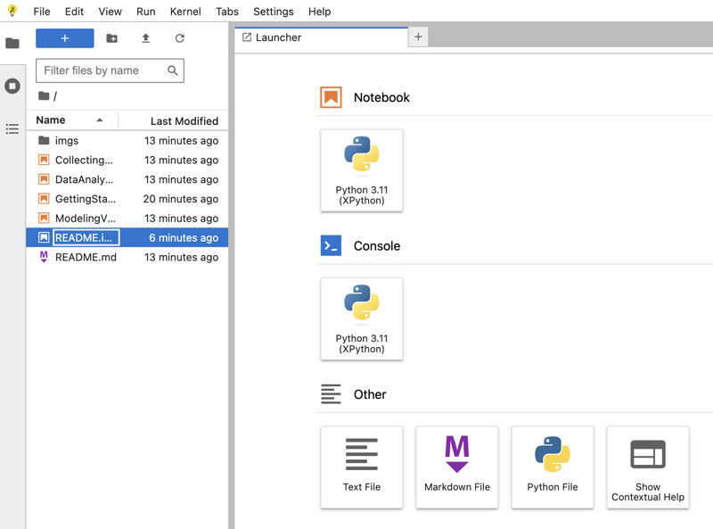

# AAPT SM 2024 Computation in the Lab Workshop

Welcome to the Computation in the Lab Workshop! 

We'll be using [python](https://python.org) and [JupyterLab](https://try.jupyter.org) as a platform to apply computational concepts in a laboratory context.

We'll be using a small [ESP-32 microcontroller](https://www.espressif.com/en/products/socs/esp32-s2) and the [Thonny IDE](https://thonny.org/) to collect real data as one might in a typical physics lab dealing with circuits.

Python will be the common programming language we'll use in both environments.

Let's start with learning python. We'll begin our work a browser based version of [Jupyter Lab](https://sspickle.github.io/SM2024-CompLab/lab/index.html).

Click on the [Jupyter Lab](https://sspickle.github.io/SM2024-CompLab/lab/index.html) link. Once the window finishes rendering you can get started by opening the "README.ipynb" notebook like so:

|Figure 1|
|:-|
||
|Jupyter Launcher View|

Enjoy!
